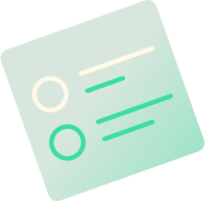
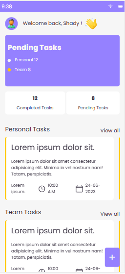

# Go Buddy

<p align='center'>

</p>

Welcome to <b>Go Buddy</b>, your ultimate task management companion! Go Buddy is a powerful ToDoList front-end application built using React and TypeScript. With Go Buddy, you can easily manage your tasks, keep track of your financial goals, and stay organized in your financial journey.

## Table of Contents

- [Introduction](#introduction)
- [Features](#features)
- [Technologies Used](#technologies-used)
- [Getting Started](#getting-started)
  - [Installation](#installation)
  - [Running the App](#running-the-app)
- [Usage](#usage)
  - [User Authentication](#user-authentication)
  - [Task Management](#task-management)
  - [Protected Routing](#protected-routing)
  - [State Management](#state-management)
- [Author](#👤-author)
- [Contributing](#contributing)
- [Show Your Support](#🙏-show-your-support)
- [License](#license)

## Introduction

Go Buddy is your go-to financial assistant, helping you manage your tasks and goals effectively. Whether you're tracking pending tasks or completed accomplishments, Go Buddy offers a seamless and intuitive user experience.

## 📃 Features

- **User Authentication:** Securely sign up and log in to your Go Buddy account to access your task lists.
- **Task Management:** Add, edit, and remove tasks as needed to stay organized and on top of your financial responsibilities.
- **Task Status:** Easily identify pending and completed tasks, ensuring that you stay motivated and focused.
- **Form Validation:** Input validation ensures that you enter accurate and relevant information for each task.
- **Protected Routing:** Enjoy peace of mind with protected routes, ensuring that only authenticated users can access sensitive data.
- **State Management using Redux:** Go Buddy utilizes Redux for efficient state management, delivering a smooth and consistent user experience.

## 💻 Technologies Used

- **React:** A popular JavaScript library for building user interfaces.
- **TypeScript:** A superset of JavaScript that adds static typing for enhanced development.
- **Redux:** A state management library for managing application state efficiently.
- **CSS Modules:** Local scope for CSS, ensuring styles are scoped to specific components.
- **React Router:** For handling routing and navigation within the application.

## 🖥️ Getting Started

Follow these steps to get Go Buddy up and running on your local machine.

### Installation

1. Clone the repository:

   ```bash
   git clone https://github.com/yourusername/go-buddy.git
   cd go-buddy
   ```

2. Install dependencies:

   ```bash
   npm install
   ```

### Running the App

Start the development server:

```bash
npm start
```

- Open your browser and navigate to http://localhost:3000 to see Go Buddy in action!

## 🖥️ Usage

### User Authentication

- Sign up for a new Go Buddy account using a valid email and password.
- Log in to your Go Buddy account with your credentials.
- Stay securely authenticated to access your tasks and financial data.

### Task Management

- Add a new task by clicking the "+" button on the dashboard and providing the necessary details.
- Edit tasks by clicking on the task and modifying the information as needed.
- Mark tasks as completed or pending, helping you track your progress.

### Protected Routing

- Certain routes are protected and require authentication to access.
- If not authenticated, you will be redirected to the login page.

### State Management

- Redux efficiently manages the application's state, ensuring a smooth experience.
- State is structured to handle task data, authentication status, and more.

## 👤 Author

- Name: **Solomon Barine Akpuru**
- GitHub: [@solobarine](https://github.com/solobarine)
- LinkedIn: [solomon-akpuru](https://www.linkedin.com/in/solomon-akpuru)

## Contributing

We welcome contributions to make Go Buddy even better. Feel free to fork the repository, make changes, and submit pull requests. For major changes, please open an issue first to discuss your ideas.

## 🙏 Show your Support

Give a ⭐️ if you like the project!

## 📝 License

Go Buddy is released under the [MIT](./LICENSE) License.

Thank you for choosing Go Buddy as task tracker. We're excited to join you on your journey to financial organization and success. If you have any questions or need assistance, feel free to reach out to our support team at support@gobuddyapp.com. Happy task tracking! 🚀
